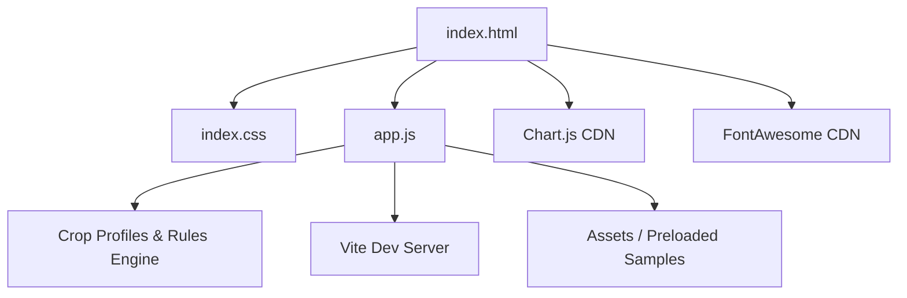

# FarmAssist AI – Smart Farming Assistant
**Track**: AI for Agriculture

FarmAssist AI is a premium, high-fidelity agronomy dashboard and intelligent agricultural expert system. It addresses critical farming challenges by providing:
1. **Precision Irrigation Schedules** based on soil sensors and weather forecasts.
2. **Targeted Fertilizer Compounding (NPK)** recipes matching soil nutrient shortages against crop-specific profiles.
3. **AI Leaf Disease Diagnostics** using mock-telemetry leaf scans with chemical and biological treatment plans.
4. **Spectral NDVI Satellite Analytics** for real-time field productivity monitoring.
5. **Interactive Harvest Chronology & Climate Yield Predictors**.
6. **Agronomy Companion Chat Agent** for real-time natural language answers.

---

## 🎨 Theme & Aesthetic System

The user interface utilizes a **Dark Forest Glassmorphic** theme:
* **Background**: Obsidian carbon-dark green (`#060a07`) with custom radial ambient glows (`rgba(16, 185, 129, 0.25)` and `rgba(6, 182, 212, 0.25)`).
* **Surfaces**: Glassmorphism cards with translucent backdrops (`backdrop-filter: blur(12px)`) and thin glowing borders (`rgba(16, 185, 129, 0.15)`).
* **Typography**: Google Fonts **Outfit** (headings & statistics) and **Inter** (highly readable details).
* **Animations**: Vertical laser diagnostics scanner line, pulsing radar rings, hovering card translates, and soft typing loaders.

---

## 🏗️ Architecture & Component Layout



### 1. Dashboard Tab
* **Environmental Conditions**: Interactive weather indicator coupled with live sensor readings (Soil moisture, humidity, solar radiation).
* **Telemetry Alert**: Auto-triggered warning banner when moisture falls below optimal thresholds.
* **Nutrient Status Chart**: A dual-dataset **Chart.js** bar chart plotting current macronutrient levels (Nitrogen, Phosphorus, Potassium) against ideal target thresholds.
* **NDVI Preview**: A quick visual reference grid highlighting stressed zones.

### 2. AI Disease Scanner
* **Image Capture Area**: Supports drag-and-drop or manual upload of crop leaves.
* **Preloaded Leaf Diagnostics**: High-resolution close-ups of **Tomato Blight**, **Corn Rust**, and **Healthy Wheat**.
* **Diagnostic Laser**: Sweeps leaf images during a 2-second processing state.
* **Medical Report**: Displays disease name, AI confidence, pathogen profile, symptom list, organic remedies, and chemical spray ratios.

### 3. Soil & Water Optimizer
* **Dynamic Sliders**: Controls for Soil Moisture, pH, and Nitrogen (N), Phosphorus (P), Potassium (K) levels in mg/kg.
* **Recommendation Engine**:
  * **Watering**: Computes exact irrigation requirements (liters per square meter) and specifies optimal watering window schedules based on weather forecasts.
  * **NPK Recipe**: Calculates NPK deficits and generates custom blending ratios (e.g., `20 - 10 - 5`) and dosage recommendations (kg/hectare).
  * **pH Correction**: Recommends agricultural lime or sulfur buffer additions if soil pH falls outside target brackets.

### 4. Harvest Timeline
* **Yield Forecasts**: Dynamically estimates harvest dates and total metric tons/hectare.
* **Climate Adjustments**: Models warm or cold weather patterns, demonstrating direct acceleration/delay on harvest dates and yield health indicators.
* **Stage Timeline Nodes**: Visualizes growth progression from Germination to Maturity. Clicking nodes renders specific agricultural checklists.

### 5. NDVI Satellite Map
* **16-Field Grid**: Displays color-coded fields by spectral reflectance health index.
* **Field Segment Analysis**: Retrieves coordinates, NDVI values, size, and crop types.
* **Trend Analytics**: Displays historical 4-week crop vigor lines using Chart.js.

### 6. FarmAssist AI Chat Agent
* **Floating Widget**: Expands into a chat panel.
* **Quick Prompts**: Preloaded button chips to instantly retrieve advice on blight, soil pH, or harvesting.
* **Typing Indicator**: Simulates real-time chatbot response streaming.

---

## 🚀 How to Run the App

1. Ensure [Node.js](https://nodejs.org/) is installed on your computer.
2. Navigate to the project folder (`d:\New folder (2)`) in your terminal.
3. Install Vite:
   ```bash
   npm install
   ```
4. Start the development server:
   ```bash
   npm run dev
   ```
5. Open your browser and go to `http://localhost:3000/`.
