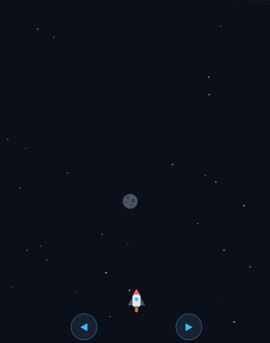
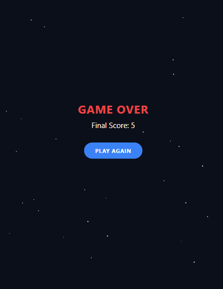

# Space Escape Runner 🚀🌌

An exciting, responsive, retro-themed Space Escape game built with **Expo**, **React Native**, and **React Native Reanimated**. Dodge incoming asteroids, rack up points, and survive as long as you can in this outer-space runner!

## 🎮 Gameplay Preview

| Active Gameplay | Game Over Screen |
| :---: | :---: |
|  |  |

## 🌟 Features
* **Dynamic Physics & Game Loop**: Smooth animation loop using high-frequency timer cycles.
* **Responsive Layout**: Adapts cleanly to both Mobile (native dimensions) and Web platforms.
* **Dual Control Schemes**:
  * **Mobile**: Interactive touch button controls at the bottom of the screen.
  * **Web**: Native keyboard support using `ArrowLeft`/`ArrowRight` or `A`/`D` keys.
* **Starfield Background Effect**: Parallax space field animation with randomized stars.
* **Premium Theme Shell**: Native tab bar routing system with custom dark mode colors.

---

## 🚀 Get Started

### 1. Install dependencies
```bash
npm install
```

### 2. Run the Development Server
```bash
npx expo start
```
Select `w` to open in your browser, or scan the QR code to run on your Android/iOS device via Expo Go or a Development Build.

### 3. Production Build (Web Static Export)
To compile a fully optimized production build for the Web:
```bash
npx expo export --platform web
```
The static bundle will be exported to the `dist/` directory.

---

## 🛠️ Tech Stack & Structure
* **Framework**: [Expo v57](https://docs.expo.dev/) & [React Native](https://reactnative.dev/)
* **Routing**: [Expo Router v4](https://docs.expo.dev/router/introduction/)
* **Linting**: ESLint (strictly verified, 0 errors/warnings)
* **Language**: TypeScript (fully typed)
