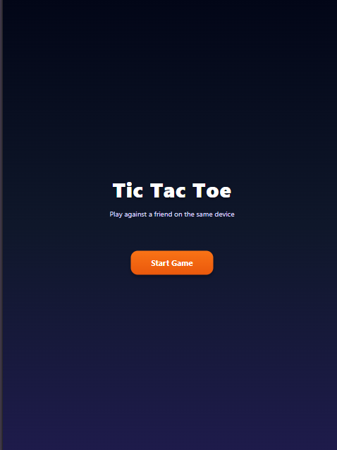
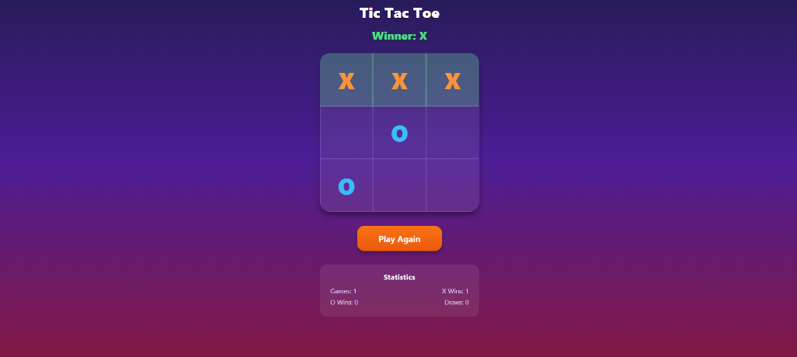

# Tic Tac Toe (Mobile App)

A modern, visually stunning, and highly responsive **Tic Tac Toe** game built using **React Native**, **TypeScript**, and **Expo**. This app features a premium dark theme with sleek gradients, glassmorphic UI elements, satisfying micro-animations, and persistent statistics tracking.

---

## 📸 Screenshots

Here is a preview of the application in action:

<p align="center">
  
  &nbsp;&nbsp;&nbsp;&nbsp;
  
</p>

---

## ✨ Features

- **Rich Premium Aesthetics**: Features a vibrant deep indigo, violet, and magenta gradient background with a modern, glassmorphic visual system.
- **Micro-Animations & Visual Feedback**:
  - Smooth **spring animations** when X and O marks pop into the board cells.
  - Interactive **scaling and hover effects** on main control buttons.
  - A continuous **pulsing glow animation** highlighting the winning combination line on victory.
- **Persistent Game Statistics**: Keeps track of total games played, X wins, O wins, and draws, persisting the data across restarts using `@react-native-async-storage/async-storage`.
- **Responsive Layout**: Designed to adapt perfectly to any device screen size (phones, tablets, and web) using dynamic viewport dimension calculations.
- **Clean Architecture**: Written in TypeScript using React hooks, clean component structuring, and standard styling sheets.

---

## 🛠️ Tech Stack

- **Framework**: [Expo SDK 57](https://expo.dev) & React Native (0.86)
- **Language**: TypeScript
- **Styling**: React Native StyleSheet & Linear Gradient
- **Navigation/Routing**: Expo Router (file-based routing)
- **Data Persistence**: React Native Async Storage
- **Animations**: React Native Animated API

---

## 🚀 Getting Started

Follow these steps to get a local copy of the project up and running:

### Prerequisites

Make sure you have Node.js installed. You also need either the Expo Go app on your physical device or an emulator configured (Android Studio / Xcode).

### Installation

1. **Clone the repository:**
   ```bash
   git clone https://github.com/Manoj-codes02/crafted-with-ai.git
   cd crafted-with-ai/TicTacTok
   ```

2. **Install dependencies:**
   ```bash
   npm install
   ```

### Running the App

Start the Expo development server:

```bash
npx expo start
```

Once the server is running, you can:
- **Scan the QR Code** with the Expo Go app (Android) or Camera app (iOS) to run the game on a physical device.
- Press **`a`** to open in an Android Emulator.
- Press **`i`** to open in an iOS Simulator.
- Press **`w`** to run in a web browser.

---

## 📄 License

This project is licensed under the MIT License - see the [LICENSE](LICENSE) file for details.
